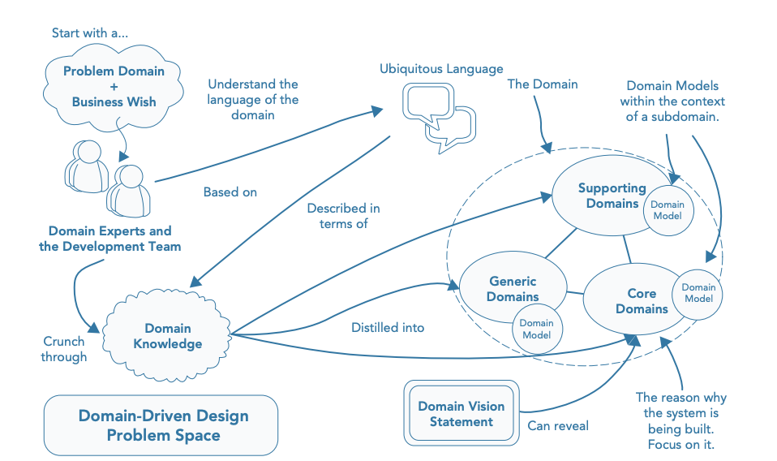

# Patters, Principles, and Practices of DDD

__Writing software is easy__. When it comes to modifying code written by other developers or code
you wrote six months ago, it can be a bit of a bore at beast and a nightmare at worst. It may contain all the
right frameworks and patterns, and had been created using an agile approach, but introducing new features into the
codebase is harder than it should be. Even business experts aren't helpful because the code bears no resemblance to
the language they use.

## Domain Driven Design (DDD)

> DDD is a process that aligns your code with the reality of your problem domain.

Although DDD understands the need for software patterns, principles, methodologies, and frameworks, it values
developers and domain experts working together to understand domain concepts, policies, and logic equally. With
a greater knowledge of the problem domain and a synergy with the business, developers are more likely to
build software that is more flexible and readable and easier to adapt for future enhancement.

## Problem Space

Before you can develop a solution, you must understand the problem. DDD emphasizes the need to focus on the business
problem domain:

* terminology
* core reasons behind why the software is being developed
* success meaning for the business

The need for the development team to value domain knowledge just as much as technical expertise is vital to gain a deeper
insight into the problem domain and to decompose large domains into smaller subdomains.

## Solution Space

Strategic patterns of DDD can help you implement a technical solution in synergy with the problem space. Patterns
enable core parts of your system that are crucial to the success of the product to be protected from the generic areas.
Isolating integral components allows them to be modified without having a rippling effect throughout the system.

Core parts of your product that are sufficiently complex or will frequently change should be based on a model.
The tactical patterns of DDD along with Model-Driven Design will help you create a useful model of your domain
in code. A model is the home to all of the domain logic that enables your application to fulfill business use cases.
A model is kept separate from technical complexities to enable business rules and policies to evolve. A model that is in
synergy with the problem domain will enable your software to be adaptable and understood by other developers and
business experts.

