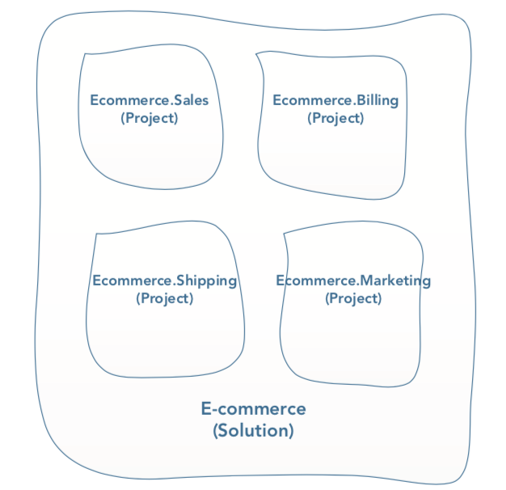
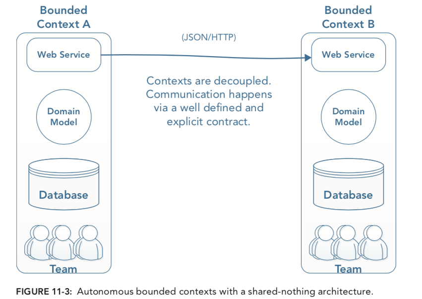
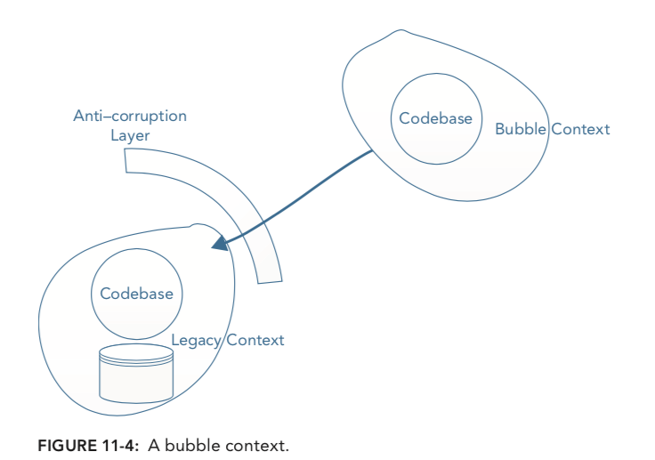
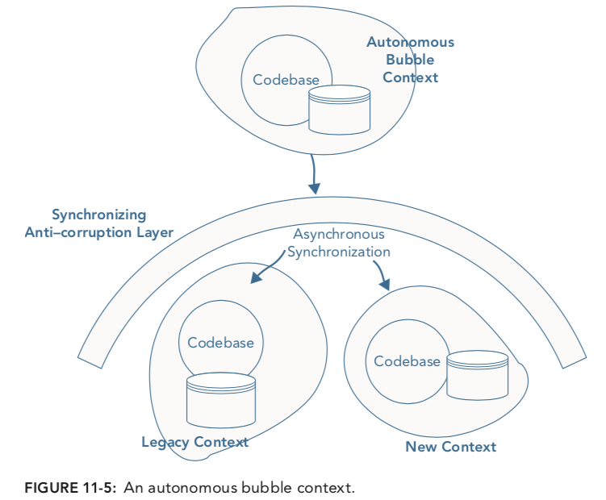
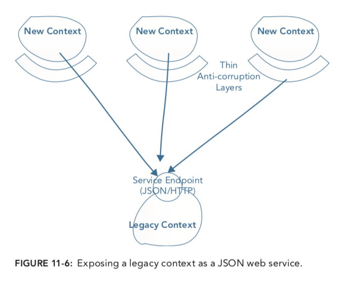

# Strategic Patterns

* Introduction to Bounded Context Integration
* Integrating via Messaging
* Integrating via HTTP with RPC and REST

## Bounded Context Integration

* How to integrate bounded contexts that form a distributed system.
* Fundamental challenges inherent to building distributed systems.
* Understanding how [SOA](https://en.wikipedia.org/wiki/Service-oriented_architecture) can help to build loosely coupled bounded contexts and independent teams.
* Addressing nonfunctional requirements while keeping an explicit event-driven domain model using reactive DDD.

### SOA adoption

SOA is an architectural style for building business-oriented, loosely coupled software services. By conceptualizing
bounded contexts as SOA services, you can create loosely coupled bounded context that help solve the technical
and social challenges of bounded context integration.

Event-driven reactive programming synergies with DDD by modeling communication between bounded contexts as
events that occur in the domain.

### How to integrate

The massive responsibility of choosing relationships and methods of communication between software services can have
significant impacts on the speed of delivery, efficiency, and success of a project. Choosing the communication
method is often easier once you've identified the relationship.

#### Bounded Contexts are Autonomous

As systems grow, dependencies become more significant in a negative way. You should strive to avoid
most forms of coupling unless you have a very good reason. This means one team can break another's team
code or cause bottlenecks that slow down the delivery of new features. A runtime coupling between subsystems
means that one system cannot function without the other.

If you design loosely coupled bounded contexts that limit dependencies, each one can be developed in isolation.
Its codebase can be evolved without fear of breaking behavior in another bounded context, and its developers
do not have to wait for developers in other bounded contexts to carry out some work or approve a change.

#### Challenges at code level

Its a good practice to partition your software systems in line with business capabilities (bounded contexts which represent
discrete business capabilities).

When you're looking at the shipping code, you're focused on shipping part of the business. It's not that helpful if
you have concepts from the Sale Department, getting in the way of adding a new feature that integrates a new shipping
provider. In fact, making changes to the shipping code might break sales features.

In DDD, you can use the __Single Responsibility Principle (SRP)__ to isolate separate business capabilities into
separate bounded contexts. It is sometimes acceptable for your bonded contexts to live as separates modules/projects
inside the same solution, though.

#### Multiple bounded contexts exist within a solution

Understanding the bigger picture is important because bounded contexts combine to carry out full business use cases.

There is no single correct answer that determines where the code for your bounded contexts should live. You need to
asses the trade-offs and decide.

#### Namespaces or Projects to Keep Bounded Contexts Separate

If two bounded contexts use code from another project inside the same solution, there is a dangerous risk
of one bounded context breaking the other.

#### Integrating via the Database

A common dependency that slows down teams. For example, the Sales bounded context's team wants to update the
`User` schema, but no one is sure if this will break code in the Shipping bounded context or the Billing bounded
context.

Another common problem is that each model that integrates through has similar but distinct domain concepts. This
strategy becomes painful when multiple models use the same shared schema.

In a shared schema, for example a model may require a column that has no relevance to another one, yet the shared schema
will ned to include the new field. In some scenarios columns may even be used for different purposes by each model.

Creating reports from a shared schema that is used by multiple bounded contexts can be error-prone, ambiguous, or 
misleading to the business.

Fundamentally, sharing a schema between models with different semantics can be an expensive violation of the SRP.
As the system grows, the pain is likely to increase exponentially as each bounded context pulls in different directions.

#### Multiple teams working in a Single Codebase

If you split your domain into multiple bounded contexts that, and all your developers are working on a single
large codebase you will have more WIP on a single codebase tat if you had a greater number of smaller code bases.

Excess WIP is a prolific, and usually unnoticed, source of inefficiency in the software industry.

WIP is a problem when you want to release new features. How can you release one completed feature if other features
are still in progress? Many teams turn to feature branches, but they may been working on it for two weeks, and you
may be so far behind that the merge may not even be possible. You can spend as much time fighting merges and
releasing code as you spend on writing it.

In a large domain, you can easily have 10 or more developers all working on separate features. They will make great
progress in adding the new features, but as-mentioned, trying to merge and release the code can be excruciatingly painful.
Consequently deploys are likely to be more risky, needing more QA and manual regression testing.

A single codebase, shared by multiple teams can result in heavy costs to the business.

#### Models Blur

If you have a complex domain that effectively has multiple bounded contexts, but you have only one codebase, it is
inevitable that boundaries of each model will not remain intact. Code from one bounded context will become coupled to code
in another.

Alternatively, if you have separate projects/modules for each bounded context, you remove the possibility of coupling.
You might have code in two bounded contexts that look very similar, and you may feel you are violating DRY,
but a lot of the time that is not the problem.

Very often you will find that even though the code looks the same to begin with, it changes in each bounded context
for different reasons as new concepts and insights emerge. There is no friction when you try to incorporate the new concepts
and insights.

There are very few reasons that the same concept in two bounded contexts should be changed at the same time. It's far more important
isolating your bounded context and maintaining their boundaries.

---

### Physical boundaries to enforce clean models

Most widely approach is to use a shared-nothing architecture, where each bounded context has its own
code bases, data stores, and team of developers.

The clear physical separation allows each bounded context to evolve only for internal reasons, resulting in an
un-compromised domain model and more efficiently delivery of business value in the short and long term.

---

### Integrating Legacy Systems

There are a number of patterns you can use to limit the impact of the legacy on other parts of the system. These
patterns help you manage the complexity and save you from having to reduce the explicitness of your new code in order to
integrate the legacy components. 

[Patterns provided by Eric Evans in his paper: "Getting Started with DDD When Surrounded by Legacy Systems](http://domainlanguage.com/ddd/strategy/ GettingStartedWithDDDWhenSurroundedByLegacySystemsV1.pdf.)

#### Bubble Contexts

Bubble contexts isolated from existing code bases, which provide a clean slate for creating and evolving a
domain model. Remember, DDD works best when you have full control over the domain model and are free to
frequently iterate on it as you gain new domain insights.

For bubble contexts to be effective, a translation layer is necessary between the bubble and the legacy model(s).
The DDD concept of __anti-corruption layer (ACL)__ is ideal for this need.

Design and implementation of the __ACL__ is a key activity when building a bubble context. It needs to keep detail
of the legacy system completely isolated from the bubble while at the same time accurately translating queries
and commands from the bubble into queries and commands in the legacy model. It then has to map the response from the
legacy into the format demanded by the bubble. Accordingly, the ACL itself can be a complex component that requires a lot
of continued investment.

#### Autonomous Bubble Context

Whereas a bubble context gets all its data from the legacy system, an autonomous bubble is more independent,
having its own database(s) and being able to run in isolation of the legacy code or other bounded contexts.

Sometimes crucial to the autonomous bubble context's independence is asynchronous communication with other
new and legacy contexts. Consequently a Synchronizing ACL often takes on the role of carrying out the
asynchronous communication.

Since the autonomous bubble context has its own database it does not require updating legacy codebase or schemas.
Any new data can be stored in the autonomous bubble database. However, the costs and complexity of asynchronous
synchronization can be significantly higher.

#### Exposing Legacy Systems as Services (Open Host)

When a legacy system needs to be consumed by multiple new contexts the cost of creating a dedicated ACL for
each context can be excessive. Instead, you can expose the legacy context as a service that requires less
translation by the new context. A common, and often simple approach is to expose an HTTP API that returns JSON.

This is formally known as the __Open Host__ pattern.

Each consuming context must still translate the response from the legacy context into its own internal model, however,
the translation complexity in this scenario should be mitigated by the simplicity of the API provided by the open host.

### Integrating Distributed Bounded Contexts

