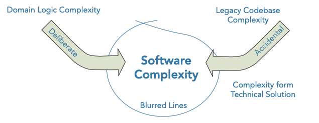

# What is Domain-Driven Design? 

* DDD Philosophy
* How the patterns of DDD manage complexity
* How to apply to both problem and solution space
* Strategic and tactical patterns
* Practices and Principles
* Common misconceptions
* Terminology
    * Analysis Model
    * Problem Domain

Domain-Driven-Design is a _development philosophy_ defined by Eric Evans in his seminal work _Domain-Driven Design:
Tackling Complexity in the Heart of Software_ (2003). DDD is an approach to software development that enables teams
to effectively manage the construction and maintenance of software for complex problem domains.

## Challenges of creating software for complex problem domains

By far the most popular software architectural design pattern for business applications is the
__Big Ball of Mud (BBoM)__ pattern. The definition of BBoM, as defined by Brian Foote and Joseph Yoder is:

> "... a haphazardly structured, sprawling, sloppy, duct-tape-and-baling-wire, spaghetti code jungle."

Foote and Yoder use the term __BBoM__ to describe an application that appears to have no distinguishable architecture.

The issue with allowing software to dissolve into a BBoM becomes apparent when routine changes in workflow and small
feature enhancements become a challenge to implement due to the difficulties in reading and understanding the
existing codebase.

Eric Evans describes such systems as containing:

> "code that does something useful, but without explaining how."

One of the main reasons software becomes complex and difficult to manage is due to the mixing of domain complexities
with technical complexities.

#### Code Created Without a Common Language

A lack of focus on a shared language and knowledge of the problem domain results in a codebase that works
but does not reveal the intent of the business.

Code without a binding to an analysis model that the business understands will degrade over time and is
therefore more likely to result in an architecture that resembles the BBoM pattern.

#### The Ball of Mud Stifles Development

Newer versions of the product are likely to be buggy due to the unintelligible mess of the codebase that developers have
to deal with. Over time, development team increasingly complains about the difficulty of working in such a mess.
Even if resources are added to the project, velocity cannot be increased to a level that satisfies the business.

Even if request for the dreaded application rewrite is granted, without due care and consideration, the project can
fall foul of the same issues that created the original BBoM. This entire experience can be frustrating for the business
that saw a great ROI in terms of features and speed of delivery at the beginning, but over time, even with additional
investment in resources, did not see the sustained evolution of a messy bug-prone code base that you hate dealing with.

#### Lack of Focus on the Problem Domain

Coding is the easy part of development. Outside of non-functional requirements, creating and keeping a useful
software model of the domain that can fulfill business-use cases is the difficult part.
 
However, the more you invest in understanding your business domain, the better equipped you will be when you
are trying to model it in software to solve its inherent business problems.

---

## How Patterns of DDD manage complexity

### Strategic patterns

Strategic patterns distil the problem domain and shape the architecture of an application (solution).

#### Distilling the Problem Domain to Reveal What is Important

Distill large problem domains into more manageable subdomains. This distillation reveals the core sub domain (the 
reason the software is being written). The core domain is the driving force behind the product under development.
It is the fundamental reason it is being built. DDD emphasizes the need to focus effort and talent on the core 
sub-domain(s) as this is the area that holds the most value and is key to the success of the application.

This clarity on where to focus effort can also empower teams to look for off-the-shelve solutions for some of the
less important parts of a system, which means that they have more time to focus on what is important and ensure
that the core domain does not become a BBoM.

Discovering the core domain helps teams understand why they're producing the software and what it means for the
software to be successful to the business, and this will enable the development team to identify and invest its time
in the most important parts of the system.

Investment in code quality for the key areas of an application will help it change with the business. If key areas
of the software are not in synergy with the business domain ten, over time, it is likely that the design will rot
and turn into a BBoM, resulting in hard-to-maintain software.

#### Creating a Model to Solve Domain Problems

In the solution space, a software model is built for each sub-domain to handle domain problems and to align
the software with the business contours.

Development team should focus as much energy and effort on the model and domain logic as it does on the pure technical
aspects of the application. To avoid accidental technical complexity the model is kept isolated from
infrastructure code.

The most appropriate design patterns are used based on the complexity needs of each sub-domain.

#### Shared Language to Enable Modeling Collaboration

Models are built through the collaboration of domain experts and development team.

Communication is achieved using an ever-evolving shared language known as __Ubiquitous Language (UL)__ to efficiently
and effectively connect a software model to a conceptual analysis model.

Insights, concepts, and terms that are discovered at a coding level are replicated in the UL and therefore the
analytical model. Likewise, when the business reveals hidden concepts at the analysis model level, this insight is fed back
into the code model. This is the key than enables to evolve the model in collaboration.

### Tactical Patterns

Also known as __model building blocks__, are a collection of patterns that help to create effective models
for complex bounded contexts (implement rich domain model).

#### Problem Space and Solution Space

DDD's impact in the problem space (distilling the problem domain into more manageable subdomains) is to reveal what is 
important and where to focus effort.

The solution side of DDD, covers patterns that can shape the architecture of your applications and make it easier to change.

---

## Practices and Principles of DDD

Practices and guiding principles that are kay to success with DDD philosophy.

#### Focusing on the Core Domain

Focus the most effort on the core sub-domain(s). This areas of your product will be the difference between
it being a success or a failure.

#### Learning through collaboration

Importance of collaboration between development teams and business experts to produce useful models to solve problem.
Development teams needs insights into the problem domain.

#### Creating models through exploration and experimentation

Technical code model is bound to the analysis model through the shared UL. Breakthrough in one of them, results in a change
in the another. Breakthroughs only occur when teams are given time to explore a model and experiment with its design.

#### Communication

Ability to effectively describe a model built to represent a problem domain is the foundation of DDD. The single most
important facet of DDD is the creation of UL. We need a shared language to bind analysis and mental models produced between
teams to a technical implementation.

It is the collaboration and construction of a UL that makes DDD so powerful. It enables a greater understanding of the
problem domain and more effective communication.

#### Understanding the applicability of a model

Each model built is understood within the context of its sub-domain and described using the UL. DDD ensures that each model
has its own UL that is valid only in a certain context, defining a linguistic boundary, ensuring models are understood in
a specific context to avoid ambiguity in language. Therefore a model with overlapping terms is divided into two models, each
clearly defined within its own context.

On the implementation side, strategic patterns can enforce these linguistic boundaries to enable models to evolve in isolation.
These strategic patterns result in organized code that is able to support change and rewriting.

#### Constantly evolving the model

Emphasis on the team to continually look at how useful the model is for the current problem. Challenges the team to evolve
and simplify complex models of domains as and when it gains domain insights.

New business cases may break a previously useful model, or may necessitate changes to make new or existing concepts more
explicit.

---

## Popular misconceptions of DDD

DDD can be think of as a development philosophy, it promotes a new domain-centric way of thinking. It is the learning process,
not the end goal. DDD is not a strict methodology in itself but must be used with some form of iterative software project
methodology to build and evolve a useful model.

#### Tactical Patterns are key to DDD

DDD is not just a handful of implementation patterns. DDD is less about software design patterns and more about problem
solving through collaboration.

Evans presents techniques to use software design patterns to enable models created by the development team and business
experts to be implemented using the UL. However, without the practices of analysis, and collaboration, the coding implementation
really means very little on its own. DDD is not code centric, its purpose is not to make elegant code. Software is merely an
artifact of DDD.

#### DDD is a framework

DDD does not require a special framework or database. An object-oriented methodology is useful for constructing models, but is
by no means mandatory.

DDD is architecturally agnostic in that there is no single architectural style you must follow to implement it. A single product
can include one bounded context that follows an event-centric architecture, another that utilizes a layered rich domain model,
and a third that applies the active record pattern.

#### DDD is a Silver Bullet

Not all software projects require the tactical patterns of DDD to build a rich domain model. For example, it would be a waste of
time and costly to apply all of the patterns of DDD when creating a simple blogging application.

---

## Terminology

#### What is an Analysis Model?

An analysis model is used to describe the logical design and structure of a software application. It can be represented
as sketches or by using modeling languages such as UML. It is the representation of software that non-technical people
can conceptualize in order to understand how software is constructed.

#### What is a Problem Domain?

A problem domain refers to the subject area for which you are building software.

DDD stresses the need to focus on the domain above anything else when working on creating software for large-scale
and complex business systems. Experts in the problem domain work with the development team to focus on the areas
of the domain that are useful to be able to produce valuable software.
